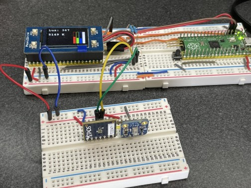
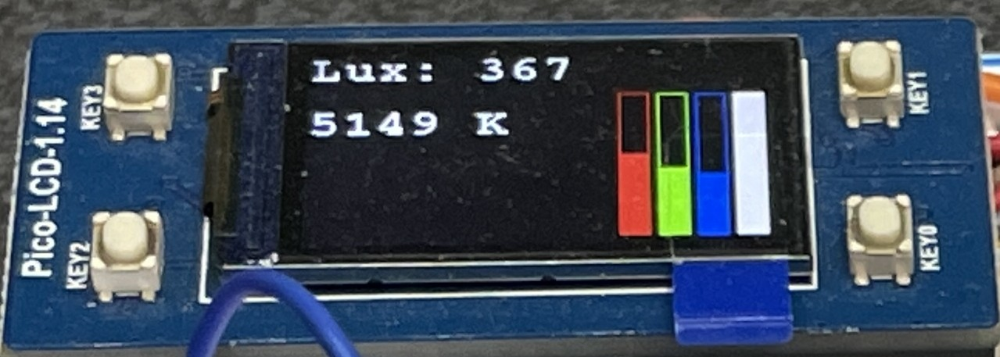

# Overview
## Problem
Lux meters and colorimeters are expensive and many include advanced features and calculations for 
photographers. The two measurements often come as two different devices as well.
There should be a simple project that can replicate the raw lux reading and
color temperature reading capabilities.

## Goal
1. Create a simple lux meter that can be relied on for reasonably accurate measurements
of ambient light.
2. Add a color sensor for measuring the intensity of different color channels and
calculate an estimated color temperature.

## Current State
* A light sensor has been integrated and is calculating an estimated lux level
* Lux level is printed to an LCD screen
* A color sensor has been integrated and is calculating an estimated color temperature
  * No calibration has been performed. The correction matrix is directly from a white paper
    by the manufacturer
* Color temperature (in Kelvin) is printed to an LCD screen
* Saturation bars for red, green, blue, and unfiltered light is painted to an LCD screen

### Images
Full setup


UI



# Workflow
## Prerequisites
### Hardware
1. 2x [Raspberry Pi Pico](https://www.pishop.us/product/raspberry-pi-pico/)
2. [Waveshare 1.14 inch LCD](https://www.amazon.com/gp/product/B08XK49TWM/ref=ppx_yo_dt_b_search_asin_image?ie=UTF8&psc=1)
    * This project was initially built using the older (v1) 4-button version of the scren.
3. [Adafruit VEML7700 Lux Sensor](https://www.adafruit.com/product/439)
4. [TCS34717 Color Sensor](https://ams.com/tcs34717)
5. Breadboard(s), wire, etc.

### Software
The projects makes use of the [Raspberry Pi Pico](https://www.raspberrypi.org/documentation/microcontrollers/raspberry-pi-pico.html)
as a programming device.
1. OpenOCD (see the getting-started-with-pico.pdf)
2. Wire up two Picos. There are several guides, but I liked the one by electronics-lab.com
   [... Ways to debug your Raspberry Pi Pico](https://www.electronics-lab.com/understanding-the-ways-to-debug-your-raspberry-pi-pico-development-board/)

## Checkout
Don't forget to init the submodules! `git submodule update --init`

## Building
### Scripts
Building on a Linux desktop is the easiest:

`cd scripts && ./build`

### Programming
Once you have your picoprobe working, you can use the script:

`cd scripts && ./load-app.bash`


### Troubleshooting
If you get an error like:

```
...
Info : RP2040 Flash Bank Command
Error: libusb_open() failed with LIBUSB_ERROR_ACCESS
Error: Failed to open or find the device
Error: Can't find a picoprobe device! Please check device connections and permissions.
Error: No Valid JTAG Interface Configured.
```

Make sure that udev rules are updated.

1. Copy the rules file `openocd/contrib/60-openocd.rules` to `/etc/udev/rules.d/`
2. Disconnect and reconnect the board.

If that does not work, make sure that the following rule is in the file:

```
# Raspberry Pi Picoprobe
ATTRS{idVendor}=="2e8a", ATTRS{idProduct}=="0004", MODE="660", GROUP="plugdev", TAG+="uaccess"
```

There is currently an open PR with this
fix: [Add picoprobe to contrib udev rules #5](https://github.com/raspberrypi/openocd/pull/5/commits/14e328ee76a02f1ab28a5f08b59d80112c9ea692)


